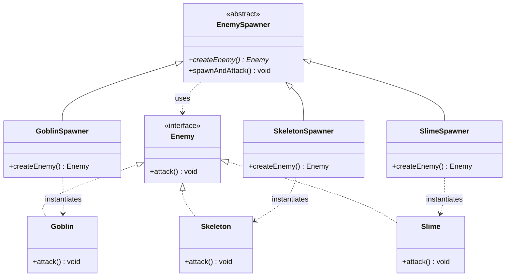
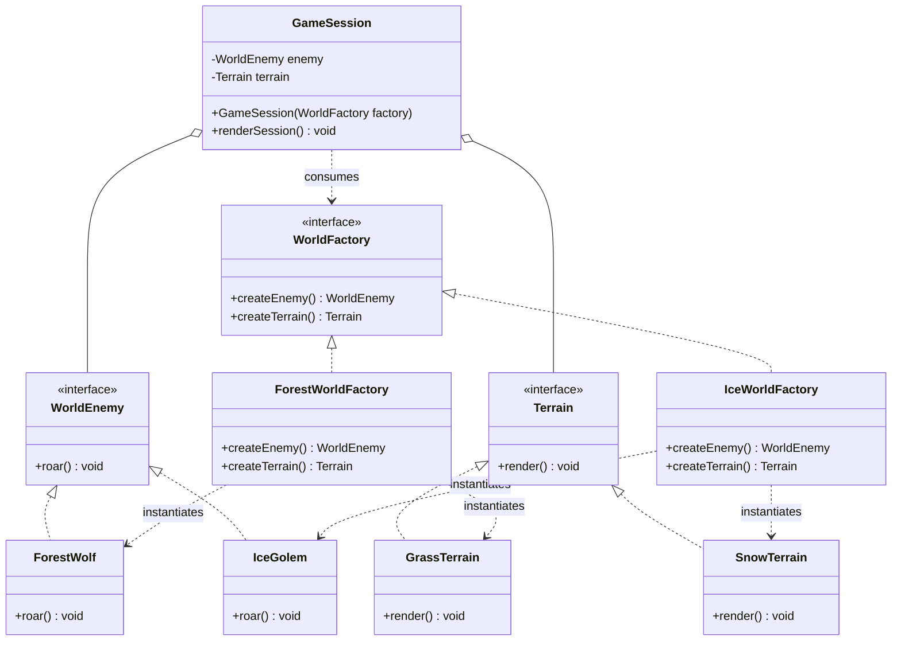

# Creational Patterns: Factory Method, Abstract Factory

## Selected Domain

**Game World Kit**

- **Part A (Factory Method):** Spawning a single enemy (`Goblin`, `Skeleton`, `Slime`).
- **Part B (Abstract Factory):** Creating a consistent world family (`Enemy` + `Terrain`) for `Forest` and `Ice` biomes.

---

## Part A: Factory Method



- **Mechanism:** Relies on **inheritance**. `EnemySpawner` defines the abstract method `createEnemy()`, and subclasses decide which concrete enemy to return.
- **Business Method:** `spawnAndAttack()` calls `createEnemy()` and uses the product through the `Enemy` interface without knowing the concrete class.

---

## Part B: Abstract Factory



- **Mechanism:** Relies on **composition**. `GameSession` accepts a `WorldFactory` in its constructor and uses it to populate its fields.
- **Family Consistency:** Ensures an `IceGolem` is never paired with `GrassTerrain`. Products within a biome are guaranteed to match.
- **Selection:** The concrete factory is chosen in exactly one place (`MainB`).

---

## Pattern comparison & SOLID

- **Factory Method vs Abstract Factory:**
  - Factory Method creates one product using inheritance (subclasses override a method).
  - Abstract Factory creates a family of related products using composition (client receives a factory object).
- **Open/Closed Principle (OCP):**
  - New enemies in Part A can be added with a new `Enemy` and `EnemySpawner` without touching existing spawners.
  - New biomes in Part B (e.g. `Desert`) can be added by implementing a new factory and products without modifying `GameSession`.
- **Single Responsibility Principle (SRP):**
  - Object creation logic is kept out of `GameSession` and game loop logic.

---

## How to run

Compile:

```bash
javac src/factorymethod/*.java src/abstractfactory/*.java -d out
```

Run Part A:

```bash
java -cp out factorymethod.MainA
```

Run Part B:

```bash
java -cp out abstractfactory.MainB
```
